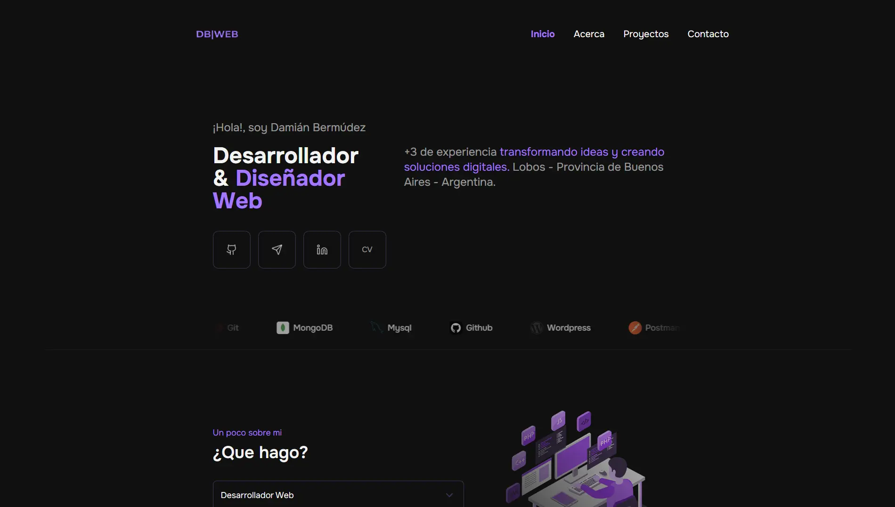

# 🌐 Mi Portafolio Web

Bienvenido a mi portafolio web, donde muestro mis proyectos y habilidades en desarrollo web. 🚀  

🔗 **[Visita mi portafolio en vivo](https://damianbermudezdev.es/)**  

## 📸 Captura de pantalla  
  

## 🚀 Tecnologías utilizadas  
- ⚡ [Astro](https://astro.build/)  
- 🎨 Tailwind CSS  
- 🔧 Vercel (para el despliegue)  
- 🛠️ Otras herramientas: Hostinger como proveedor del hosting y del dominio  

## ✨ Características  
✔️ Diseño responsivo y moderno 📱  
✔️ Animaciones suaves 🎬  
✔️ SEO optimizado para mejor visibilidad 🔍  
✔️ Carga rápida ⚡  

## 🛠 Instalación y uso  
Si deseas clonar y ejecutar este proyecto localmente:  

```bash
git clone https://github.com/tuusuario/mi-portafolio.git
cd mi-portafolio
npm install
npm run dev
```

##📬 Contacto

📧 Email: bermudezdamian7@gmail.com

🔗 LinkedIn: https://www.linkedin.com/in/damianbermudezdeveloper/

📜 Licencia
Este proyecto está bajo la licencia MIT. ¡Siéntete libre de usarlo y modificarlo!
